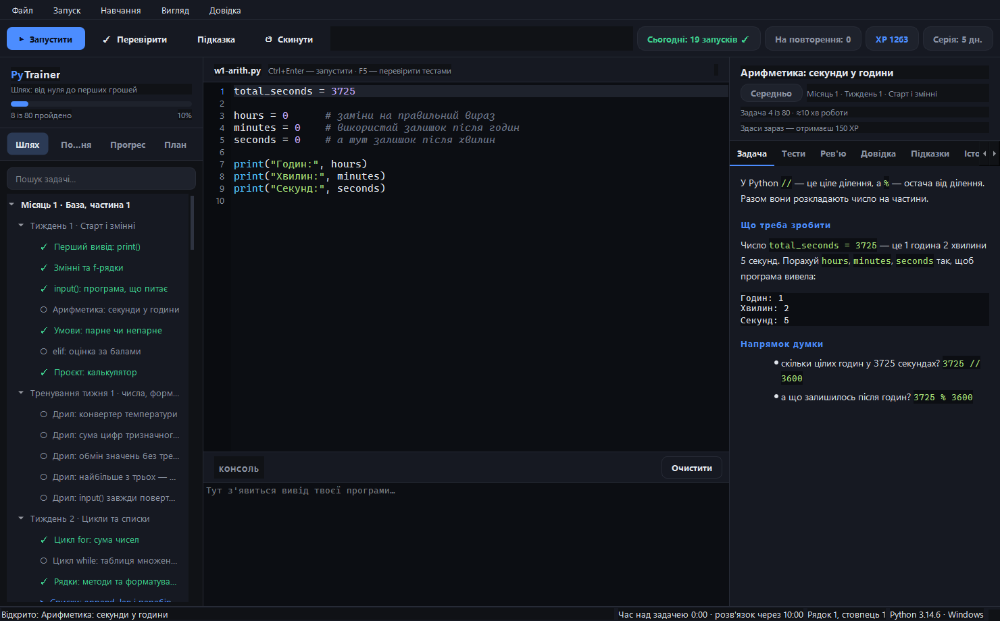
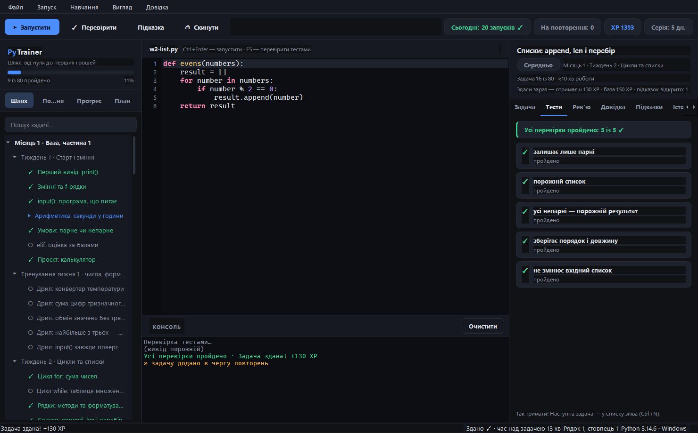
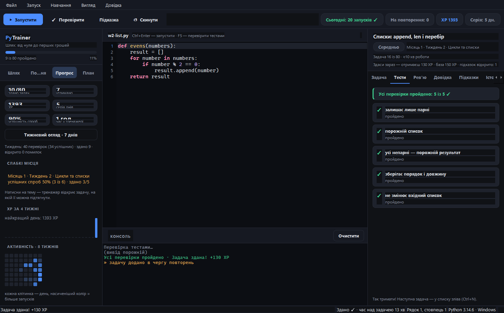
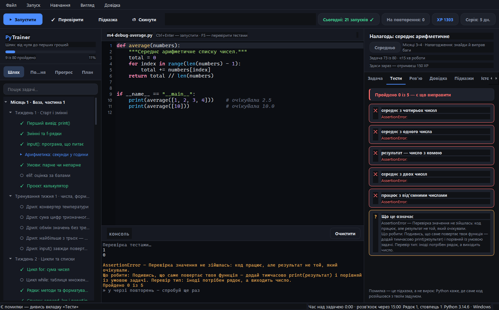
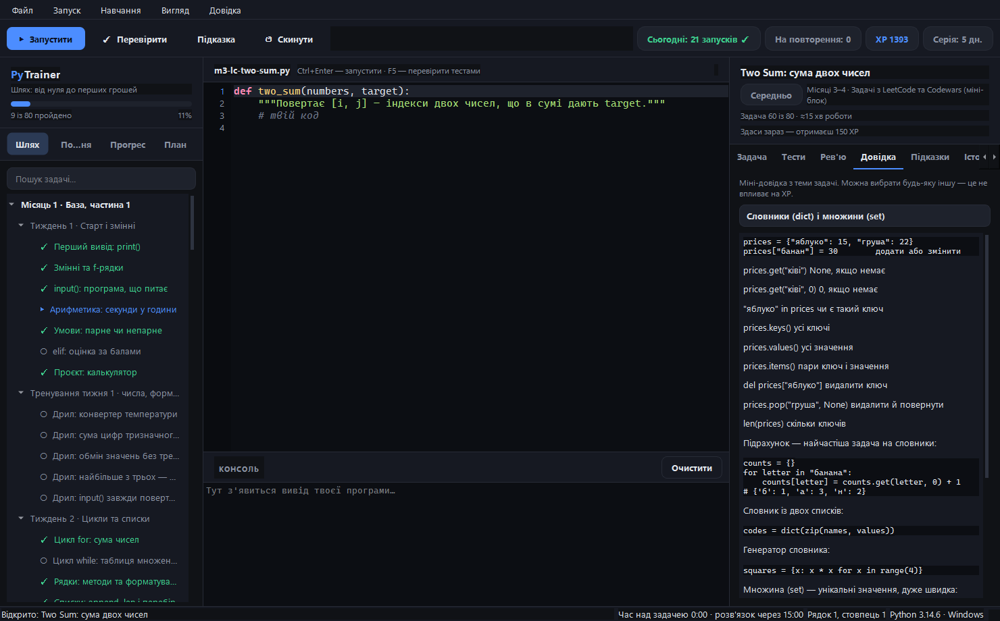
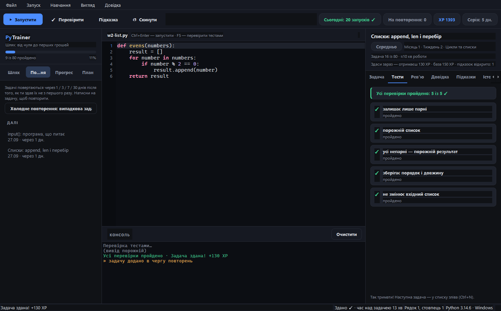
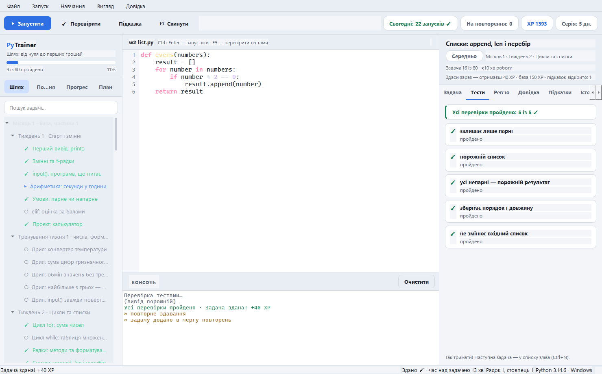
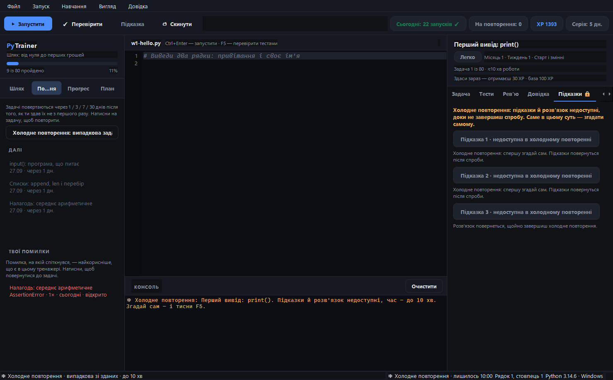
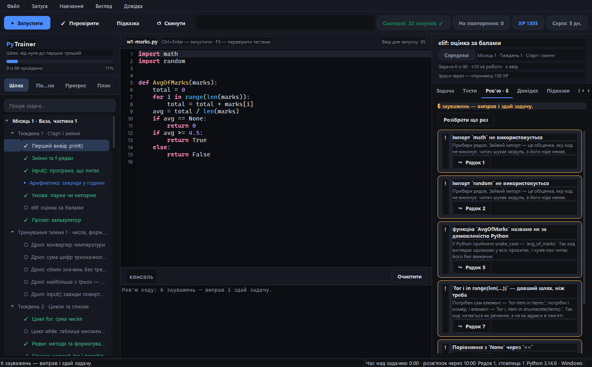
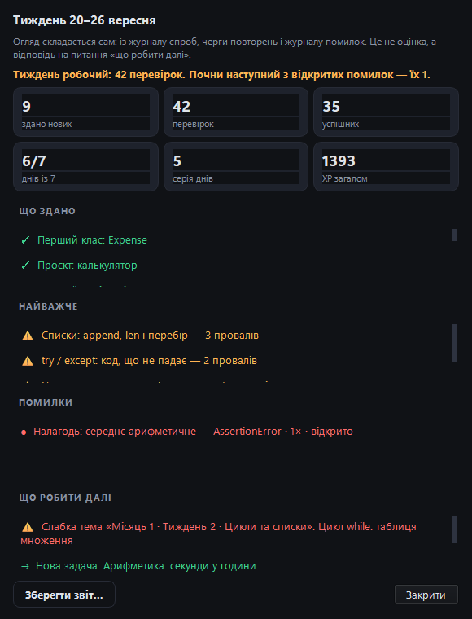

# 🐍 PyTrainer

**A desktop Python trainer that runs your code, never hands out solutions,
and makes you revisit what you forgot.**

Not a video course, not a "course with ready answers". You write code in the
built-in editor, press `F5` — and the program really runs it against hidden
tests. After 1, 3, 7 and 30 days the task comes back for review.

> UI language is Ukrainian — the product teaches through your native language.
> This README, the docs and the code comments are in English.

<!-- if the repository is named differently, replace LuxerFM/PyTrainer in the badges -->
[](https://github.com/LuxerFM/PyTrainer/actions/workflows/tests.yml)




## Why this is not "yet another course"

**You cannot fool yourself here.** Code runs for real, in a separate Python
process with a timeout: write `while True` and the process gets killed instead
of hanging the app. Checks assert on behaviour — function results and what the
program printed for a given input — not on "similarity to the answer".

**The solution is truly locked.** The third hint level unlocks after 10 minutes
of active work on the task (20–25 for projects). Only focused time counts.
Every opened hint costs XP, and pasting a ready solution into the editor
penalises the task as three hints and **always** sends it to the review queue.

**Reviews matter more than passes.** Stats track two different numbers:
"passed" and "**retained**" — a task you no longer need to review. Successful
reviews earn their own XP (the longer the survived interval, the more), so
coming back pays off instead of boring you.

**Recall is tested cold.** A solved task is easy to "recall" by recognising
your own code. So there is a separate mode — **cold review** (`Ctrl+Shift+R`):
a random solved task opens from its stub, no hints, no solution, with a 3–10
minute timer. The verdict feeds the same 1/3/7/30 queue: recalled on your
own — longer interval; didn't — back tomorrow.

## Features

| | |
|---|---|
| 🧭 **9-month path** | 5 blocks (month 1 → 7–9), 108 tasks, 80 ready to solve. The plan lives in code (`curriculum/`) and updates `Python-Roadmap.md` itself |
| 🔁 **Drills after every week** | 20 short exercises (5–12 min) in month 1: one skill per drill, checks on multiple inputs — so "typing the answer by hand" doesn't work. After a week of theory the plan walks you to training while the skill is still hot |
| 🏆 **LeetCode and Codewars tasks** | 14 tasks from 7 kyu to medium in the months 3–4 mini-block. Statements retold in Ukrainian, each with its source and a link to the original |
| ✍️ **Code editor** | Line numbers, syntax highlighting, auto-indent after `:`, Tab = 4 spaces, `Ctrl+Enter` |
| ✅ **Honest checks** | Separate process, 5 s timeout, output cap, `input()` fixtures, multi-file tasks with a real `import` |
| 🔎 **Checks are visible upfront** | Before a run, the "Tests" tab lists the checks and what they demand; the test code itself stays hidden |
| 🩺 **Errors in human language** | `NameError`, `TypeError`, `IndentationError` and 20 more types explained in Ukrainian: what it means, which line, what to do |
| ✍️ **Code review** | The "Review" tab (`F6`) reads your code via `ast` and tells you what is hard to read: dead variables and imports, `range(len())`, `== None`, swallowed exceptions, four floors of `if`. Blocks nothing, costs no XP |
| 📖 **Mini-reference per topic** | The "Cheatsheet" tab auto-picks a reference for the task: strings, lists, dicts, loops, algorithms, files, JSON, SQLite, Git |
| 💡 **Spoiler-free hints** | "where to look" → "which construct" → solution behind a timer |
| 🔁 **1/3/7/30 repetition** | Failed and "peeked" tasks come back; after the fourth review the task is retained |
| ❄ **Cold review** | A random solved task, no hints, no solution, timer up to 10 min. Picks queued tasks first; your saved code is not overwritten (`Ctrl+Shift+R`) |
| 🗓 **Weekly digest** | Once a week — a report of what is actually in the database: solved count, where you stumbled, cleanly vs aided mistake closures. A "save report" button drops a markdown file next to your progress (`Ctrl+Shift+W`) |
| 🩹 **Mistakes close, they don't pile up** | A mistake "hangs" in the journal until the task is passed cleanly — no hints, no solution. Passed with help? The "closed with help" mark stays, and the task asks for a cold review |
| 📈 **Progress and weak spots** | XP, day streak, success rate, top failing topics, 8-week activity calendar |
| 💾 **Nothing gets lost** | Code autosaves, progress lives in SQLite with `WAL` (writes never block reads), a database copy is made before every launch (`backups/`, last 7), and a corrupted database file is moved aside, never deleted — nearby `progress.json` can be exported and moved to another machine |
| 🎨 **For your eyes and mood** | Dark and light theme (`Ctrl+D`), text scaling ("View" menu), the window reopens where you closed it |
| 📦 **Runs without Python** | `PyInstaller` builds a single `PyTrainer.exe`; no internet, no admin rights, no installer needed. Portable mode (`--data-dir DIR`) keeps progress anywhere — even on a flash drive (see below) |
| 📦 **Portfolio export** | "File → Export solved tasks" lays out code into separate `.py` files + README |

<p align="center">
  
  
</p>

<p align="center">
  
  
</p>

<p align="center">
  
  
</p>

<p align="center">
  
</p>

<p align="center">
  
</p>

<p align="center">
  
</p>

## Quick start

**Windows:** double-click `start.bat` — it creates the environment and installs Qt itself.

Manually, on any system:

```bash
python -m venv .venv
.venv\Scripts\python.exe -m pip install -r requirements.txt   # Windows
.venv/bin/python -m pip install -r requirements.txt            # Linux/macOS

.venv\Scripts\python.exe main.py        # or: python -m trainer
```

**Want a look without touching your progress?** Demo mode runs on a throwaway
database with a few weeks of ready-made progress:

```bash
.venv\Scripts\python.exe main.py --demo
```

**Want proof the code checks really work?** There is a self-test: it runs code
with the right solution, a broken one and `while True` — and reports whether
the verdicts arrive. It is the same test CI runs inside the built `.exe`: the
window draws even when code execution inside `.exe` is broken, so testing the
window is pointless.

```bash
.venv\Scripts\python.exe main.py --self-test
.venv\Scripts\python.exe main.py --self-test report.json   # same, plus a file
```

## Hotkeys

| Keys | Action |
|---|---|
| `Ctrl+Enter` | run code |
| `F5` | run hidden tests |
| `Ctrl+N` | next unfinished task |
| `F6` | review your code |
| `Ctrl+R` | review queue |
| `Ctrl+Shift+R` | cold review of a random task |
| `Ctrl+P` | progress and weak spots |
| `Ctrl+Shift+W` | weekly digest |
| `Ctrl+F` | search tasks in the plan |
| `Tab` / `Shift+Tab` | indent / outdent |
| `Ctrl+S` | save code to a file |

## Adding your own task

Tasks are data, not UI code. Add one to the matching topic in `curriculum/`:

```python
task(
    id="w2-average",
    title="Arithmetic mean",
    level="Medium",
    statement="<p>Write <code>average(numbers)</code>…</p>",
    starter="def average(numbers):\n    return 0\n",
    checks=[
        code("computes the mean", "assert average([2, 4]) == 3"),
        code("empty list", "assert average([]) is None"),
    ],
    hints=[
        hint("where to look", "sum() and len() are your friends."),
        solution("def average(numbers):\n    return sum(numbers) / len(numbers) if numbers else None"),
    ],
    # for a borrowed task — source and link to the original
    source="Two Sum · LeetCode #1",
    source_url="https://leetcode.com/problems/two-sum/",
    # which cheatsheet to show in the Reference tab (see curriculum/cheatsheets.py)
    cheatsheet="dicts",
)
```

(Example translated for readability — real task titles and statements stay in Ukrainian, that is the product's language.)

Then `python -m unittest discover -s tests` — the tests verify that your
solution passes its own checks and the starter code does not.

Short drill exercises (see `curriculum/drills1.py`) are described the same way,
only smaller: 5–12 minutes, one skill, 2–4 checks on different inputs.

A task may bring its own files, and then the solution can do a real
`import utils` — like in a genuine project (see task `m2-module`).

## How it works

```
curriculum/        data: months → topics → tasks (statement, starter, checks, hints)
    cheatsheets.py   mini-reference: sheets and auto-pick per task topic
trainer/core/      engine without UI:
    runner.py        code runs in a separate process + checks
    errors.py        traceback → explanation in Ukrainian (what and what to do)
    session.py       learning rules: XP, statuses, review queue
    scoring.py       the XP and interval formulas
    review.py        cold review: which solved task to pull from memory
    db.py            SQLite: progress, attempts, hints, time
    stats.py         per-topic stats and weak-spot search
trainer/ui/        PySide6 (Qt 6) interface: theme, editor, panels
main.py            entry point
trainer/cli.py     mode picker: window, --exec-runner, --self-test
```

Three layers talk data only: `curriculum` knows nothing of Qt, the engine knows
nothing of the UI. So learning rules are testable without a window, and the same
code can drive a CLI or a web version. Details: [docs/ARCHITECTURE.md](docs/ARCHITECTURE.md).

**Code-execution safety.** User code never runs inside the app process:

- a separate process in a temp folder. In the built `.exe` `sys.executable` is
  the trainer itself, not Python, so `.exe` launches **itself** with
  `--exec-runner` and runs the file with its embedded interpreter
  (`trainer/core/exec_runner.py`);
- timeout (5 s) — hung loops are killed with all descendants;
- output cap (64 KB) — a `print` loop eats no memory;
- `stdin` comes from fixtures, so `input()` never waits for a keyboard.

## Code review

Tests say whether code works. But working code is not yet code another human
understands — and freelancers are read, not run. So there is a "Review" tab
(`F6`): it parses whatever is in the editor via `ast` — builtin Python
parsing, zero new dependencies — and tells you in plain language what hurts
reading.

| Pattern | Example |
|---|---|
| Variable nobody reads | `total = 0` with no `total` below |
| Import going nowhere | `import math` with no `math.` |
| Index walk over a list | `for i in range(len(items))` → `for item in items` |
| Comparing with `True` / `None` | `if value == None` → `if value is None` |
| Swallowed error | `except: pass` — the bug vanishes with the message |
| File without `with` | `f = open(...)` → `with open(...) as f` |
| Four floors of `if`/`for` | inner block — into a named function |
| Same number or string 3+ times | give it a constant name |
| `return True` / `return False` pair | `return condition` |
| 25+ line function | split into named steps |
| Non-Pythonic names | `AvgOfMarks` → `avg_of_marks` |

Three deliberate differences from linting:

- **it forbids nothing.** Reviews never block a task and never cost XP: they
  are read, not passed;
- **it knows the hidden checks.** Checks run in the same file, so
  `from fake_api import BASE_URL` in network tasks "goes unused" in the editor
  but the check needs it — the review accounts for such names instead of
  advising to delete what the task cannot pass without;
- **it praises.** A docstring in a function or a file opened with `with` gets
  its own card: you should see the trick you already learned, not only what
  is wrong.

Rules are pure Qt-free code (`trainer/core/codereview.py`), so each is tested
literally line by line: a bad one (must fire) and a good one (must stay
silent). The course never reviews task starters — until you wrote nothing,
any remark would scold someone else's code.

## Weekly digest

The day plan answers "what to do today". But without the second question —
"and what came of it?" — learning turns into a todo ribbon: tasks get passed,
mistakes pile up, and whether it got easier is nowhere to see. So once a week
the trainer compiles a digest (`Ctrl+Shift+W`, "Study" menu or the button on
the "Progress" page).

Inside — the same data, read together instead of apart: solved and checked
counts, active days, hardest tasks of the week, mistake states, weak topics
and **three concrete next steps** (what to review, which topic to pull up,
which new task to open). At the bottom — a one-line verdict: empty week,
ragged week or "closed clean".

**A mistake closes only on a clean pass.** The journal now has three states:

| State | What happened | What it means |
|---|---|---|
| open | no clean pass since the last mistake | go back to the task |
| closed with help | passed, but with a hint or a pasted solution | works — but recall it cold |
| closed | passed alone, no hints, no solution | the mistake is gone |

The middle state matters most. Counting every pass as "closed" turns the list
into a history of suffering you learn to ignore. Counting only clean passes
leaves an old `NameError` hanging forever after everything already works.
"Closed with help" is honestly in between — and points straight at a cold
review.

The report can be saved as a markdown file (`pytrainer-week-<date>.md`): in a
month the trainer's numbers are different, and rereading that week helps.
`trainer/core/digest.py` and `trainer/core/mistakes.py` compute everything —
no Qt, so every state and every verdict sentence is tested, and the same
report can be printed to a console.

## Tests

```bash
.venv\Scripts\python.exe -m unittest discover -s tests -v
```

464 tests: check engine, error explainer, database and copies, XP rules
and repetition, cold review, code review, mistake journal and weekly
digest, plan, reference, themes and interface
(it also launches headless).
Most valuable —
`test_curriculum.py`: it runs
**every solution** against its own task's checks and separately verifies
that starter code does **not** pass. A broken task cannot slip into the
plan unnoticed. CI runs all of it on Python 3.11 and 3.13.

Coverage is measured in CI (`coverage`) and fails below 90% — without
the gate the number would turn decorative.

## Building `.exe` (no Python needed)

Easiest path for whoever you hand the trainer to:

```bash
.venv\Scripts\python.exe -m pip install -r requirements-dev.txt
.venv\Scripts\python.exe tools\build_exe.py
```

`dist/` gets `PyTrainer.exe`, README and a short manual. One CI job builds
the same `.exe` on every push and does two things with it: launches it
headless (`--demo --screenshot`) to prove it starts, and asks it to run a real
task with checks (`--self-test`). The second matters more: the window draws
even when code execution inside the built `.exe` is broken — exactly what
happened once, and no code test caught it.

The ready archive ships in a release on tag `v*`.

```bash
git tag v0.2.0 && git push --tags   # CI builds .exe and creates the release
```

**Installing for yourself (with a desktop shortcut).** `--install` puts
`.exe` next to the project — where progress already lives, so launches from
code and from `.exe` see **one and the same database**, and progress never
forks:

```bash
.venv\Scripts\python.exe tools/build_exe.py --install
.venv\Scripts\python.exe tools/make_shortcut.py
```

The second command creates `PyTrainer.lnk` on the desktop with the app's icon.
The shortcut holds a path inside, so after moving the folder just recreate it
with the same command — that is why it is a separate script.

The spec (`pytrainer.spec`) deliberately drops unused Qt modules — without that
a one-file `.exe` weighs several times more while only using `QtCore`,
`QtGui` and `QtWidgets`.

**Important:** the built `.exe` writes progress **next to itself**, not into
the unpack folder — otherwise every quit would wipe all progress
(see `trainer/paths.py`).

## Data

| File | What it is |
|---|---|
| `pytrainer.db` | your progress (SQLite, self-created). Lives **not next to .exe** but in the system service folder: `%LOCALAPPDATA%\PyTrainer` (Windows) or `~/.local/share/PyTrainer`. Clouds (OneDrive, Dropbox) read the file whenever they feel like it, possibly mid-write — that is exactly how SQLite bases rot. Open the folder via "File → Open data folder" |
| `backups/` | silent database copies before every launch, last 7 kept (same data folder) |
| `pytrainer.lock` | launch lock: no second window on the same base, two windows would overwrite each other |
| `pytrainer.ini` | window state and look: theme, text scale, open task |
| `progress.json` | the same progress, human-readable — keep it in Git, move it between machines |
| `Python-Roadmap.md` | generated roadmap: checkboxes tick themselves as you pass tasks |

Hand edits to `Python-Roadmap.md` get overwritten: keep personal notes here, in README.

When the database moved, the app does not wipe the old file — it slides it
aside: `pytrainer.db.moved` appears nearby (plus `backups.moved/` with copies).
Honest insurance: check progress is in place, then delete — the new spot
already holds a copy.

**Need everything in one folder** — a flash drive, a classroom, no service
folders? Launch with `--data-dir DIR`:

```bash
PyTrainer.exe --data-dir D:\\PyTrainer
.venv\\Scripts\\python.exe main.py --data-dir D:\\PyTrainer   # same from code
```

Database, copies and lock land in that folder — the whole progress travels.
A database from an older version found there migrates itself and renames the
old file to `pytrainer.db.moved`, so nothing vanishes silently.

## Built-in learning rules

1. **Months 1–2 — AI as teacher only.** Ask "explain why it fails", never
   "write it for me". That is why the solution sits behind a timer.
2. **Month 3+ — the 20–30 minute rule.** Yourself first, AI second.
3. **Repetition is work, not punishment.** That is why it earns XP.
4. **Recall, not recognition.** Cold review removes hints and the solution:
   recognising your own code is easy, recalling it is not.

## By the numbers

| | |
|---|---|
| Tasks in the plan | 108 (80 ready to solve, the rest — future-month stubs) |
| Ready material | ~18 hours by task estimates; month 1 fully closed, further material is written 2–3 weeks ahead, never invented upfront |
| Tests | 464, the most valuable runs every solution against its own checks (a test itself watches the number in this README) |
| Coverage | ~95%, CI gate at 90% |
| External dependencies | 1 (PySide6); everything else is the standard library plus SQLite |
| Review cycle | 1 → 3 → 7 → 30 days |

Architecture: data in `curriculum/`, learning rules and code execution in
`trainer/core/` (no Qt), UI in `trainer/ui/` — so the logic is testable without a
window. See [docs/ARCHITECTURE.md](docs/ARCHITECTURE.md). MIT licensed.

## License

MIT — use it, change it, ship it in your projects.
